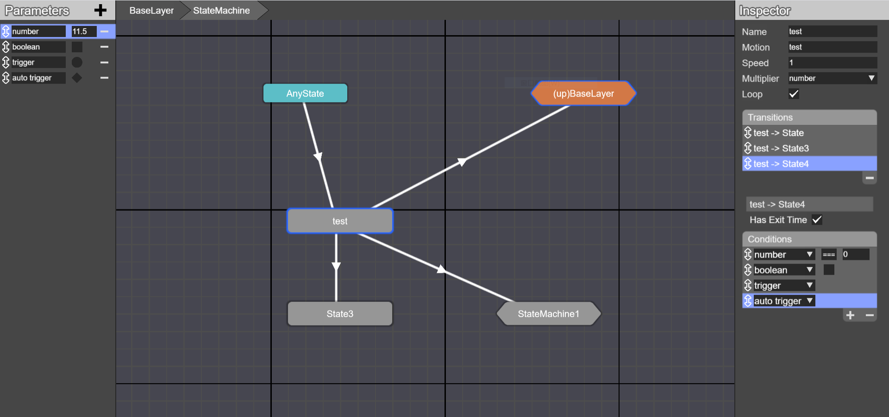
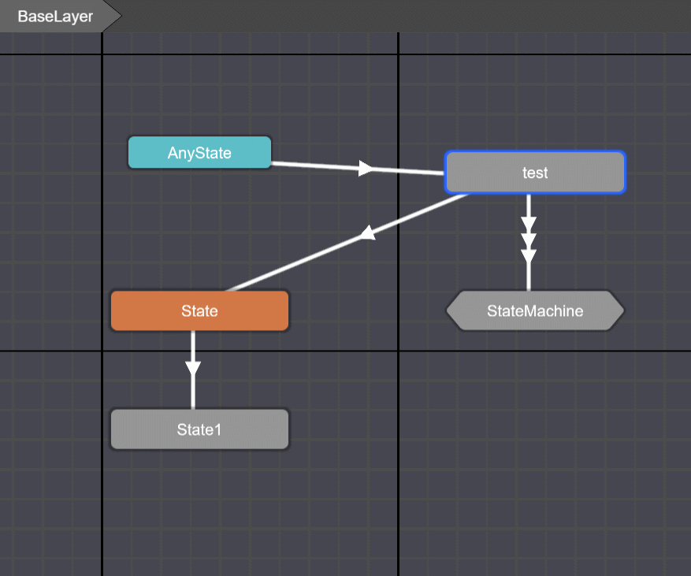
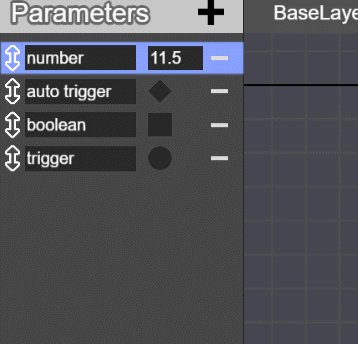
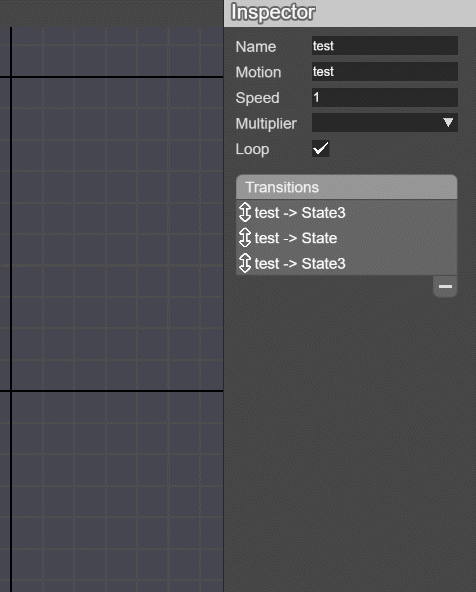
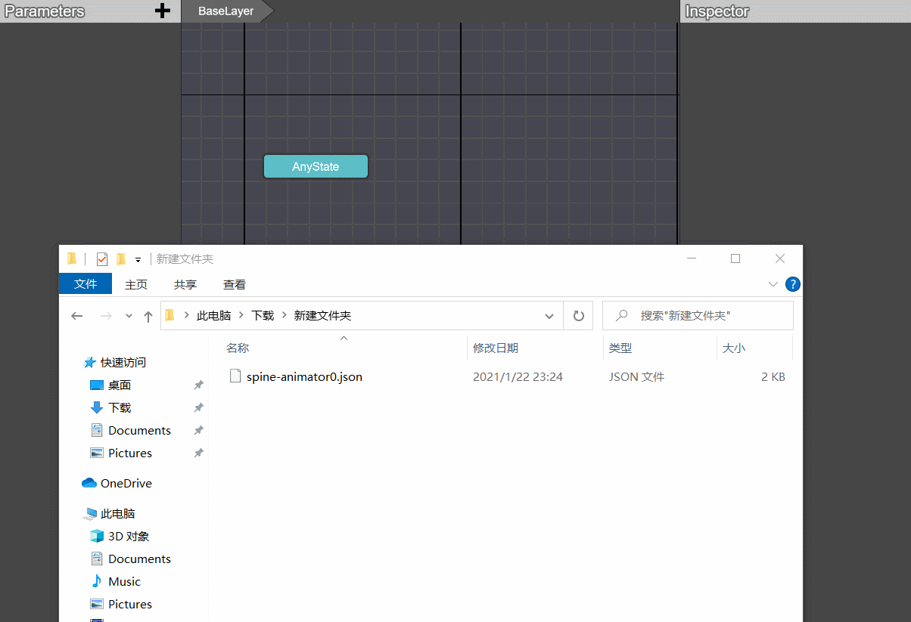
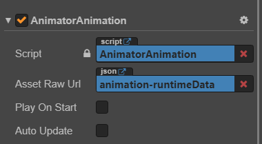
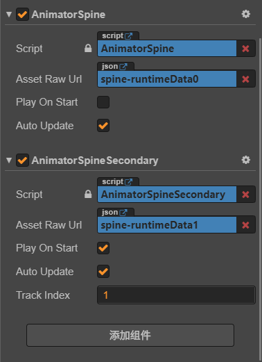
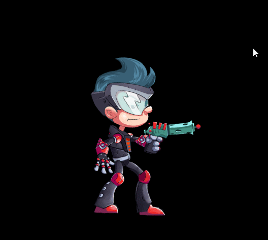

# Cocos Animator
一个用于Cocos Creator的可视化动画状态机编辑器。<br/>
编辑器地址：https://leeyip.github.io/cocos-animator/


## 目录
- [前言](#preface)
- [项目结构](#project)
- [状态机编辑器](#editor)
    - [总览](#editor1)
    - [状态机视图](#editor2)
    - [Parameters](#editor3)
    - [Inspector](#editor4)
    - [数据导入与导出](#editor5)
    - [导出的数据格式](#json)
- [Runtime](#runtime)
- [Example](#example)
- [注意点](#warning)
- [参考资料](#reference)


## <a id="preface"></a>前言
当动画数量较多且转换规则复杂的时候，手动编写代码去处理转换逻辑会非常痛苦。用过Unity的话，都知道Unity的Animator Controller能可视化地编辑状态机，在一定程度上减轻了手写逻辑的痛苦，但是Cocos Creator目前没有提供这种便利的工具，于是便有了这个项目。<br/>
动手之前，在网上看到已经有人做了一个这种工具<sup>[[1]](#reference1)</sup>，但离我想要的效果差了一点，以及runtime的实现也有一些问题，同时我也希望能随时根据需求自由更改功能，于是便用Cocos Creator另写了一个状态机编辑器，runtime的实现也在他的基础上进行了修改。


## <a id="project"></a>项目结构
- animator-editor：状态机编辑器项目源码，使用CocosCreator2.2.2实现
- animator-runtime：解析状态机的runtime源码，里面两个目录分别用于CocosCreator2.x的项目与3.0项目
- examples：用CocosCreator2.2.2与3.0rc写的简单例子


## <a id="editor"></a>状态机编辑器
操作基本和Unity Animator类似</br>

#### <a id="editor1"></a>**总览**</br>
编辑器界面分为三个部分
</br>
- 左侧用于编辑状态机参数，参数分为number、boolean、trigger、auto trigger四种类型。
- 中间用于编辑状态、子状态机以及状态之间的连线关系，上侧的导航栏用于显示当前视图状态机的层级关系，BaseLayer为根状态机。
- 右侧用于编辑状态与状态转换连线的数据。

#### <a id="editor2"></a>**状态机视图**</br>


</br>
- 操作方式：
    - 鼠标滚轮可缩放以及拖动视图
    - 鼠标右键空白处可选择生成状态或子状态机节点
    - 鼠标右键状态可选择生成状态转换连线、设置默认状态、删除
    - 鼠标左键按住状态拖动到状态机上出现加号，即可将状态丢入状态机内
    - 鼠标右键子状态机可选择删除
    - 鼠标双击子状态机可进入子状态机视图
    - 鼠标左键选中状态、子状态机、连线时均可用delete键删除
    - 鼠标左键可以拉伸调节Parameters和Inspector两个界面宽度
    - 有上下双向箭头的地方是可拖拽排序的列表
- 状态：用矩形表示，橙色为默认状态，是整个状态机运行的入口。AnyState是一种特殊的状态，用于指代任意状态，仅能由AnyState将连线指向其余状态，无法将连线指向AnyState。
- 子状态机：用六边形表示，内部包含默认状态则显示为橙色，名字中带有(up)的状态机为当前视图的父状态机。

#### <a id="editor3"></a>**Parameters**</br>
用于编辑状态机参数，可填写初始值表示状态机开始运行时的参数状态
- **number** 数字输入框
- **boolean** 方形勾选框
- **trigger** 圆形勾选框，与Unity中trigger表现一致，内部是一个boolean，在满足包含trigger条件的状态转换时会自动resetTrigger
- **auto trigger** 菱形勾选框，在满足状态转换时以及每帧状态机逻辑更新时都会自动reset为false

#### <a id="editor4"></a>**Inspector**</br>
用于编辑状态以及连线数据</br>
- **Name**--状态/状态机名</br>
- **Motion**--状态对应的动画名</br>
- **Speed**--动画播放速度</br>
- **Multiplier**--动画播放速度混合的number类型参数</br>
- **Loop**--动画是否循环播放</br>
- **Transitions**（连线数据）：
    - 记录状态间的转换关系（当前状态->目标状态）
    - **优先级**：同一个状态有多个transition的情况下，优先满足哪一个就先转向对应的目标状态，若同时满足多个transition，则以列表中从上往下的排序决定优先级（选中状态时才可以拖拽排序）
    - **Has Exit Time**打勾则表示会等待动画播放结束才能转向下一状态
    - **Conditions**（转换条件）：所有条件都是逻辑与的关系，必须同时满足所选择的逻辑关系（若勾选了Has Exit Time，还需等待动画播放完毕）才能转向下一状态

#### <a id="editor5"></a>**数据导入与导出**
- 导出数据
    - **ctrl+s**--导出状态机编辑器工程文件（此文件记录了编辑器与runtime所需的所有数据，此文件必须保存好）
    - **ctrl+e**--仅导出runtime所需的数据文件
- 导入数据
    - 将ctrl+s所保存文件拖入状态机编辑器内将还原整个状态机视图
    - cocos creator的animation文件、spine的json文件、dragonbones的json文件均可拖入状态机编辑器内自动生成对应的状态节点
    

#### <a id="json"></a>导出的数据格式
- 状态机编辑器工程数据格式
```
{
    /** 编辑器版本号 */
    animator: string;
    parameters: [
        {
            /** 参数名 */
            param: string;
            /** 参数类型 */
            type: ParamType;
            /** 初始值 */
            init: number;
        }
    ];
    mainStateMachine: {
        layerPos: [number, number];
        layerScale: number;
        anyStatePos: [number, number];

        subStates: string[];
        subStateMachines: string[];
    };
    subStateMachines: [
        {
            /** 此状态机视图坐标 */
            layerPos: [number, number];
            /** 此状态机视图缩放 */
            layerScale: number;
            /** 此状态机视图内AnyState坐标 */
            anyStatePos: [number, number];

            /** 状态机名 **/
            name: string;
            /** 在父状态机视图下的坐标 */
            position: [number, number];
            /** 父状态机 **/
            upStateMachine: string;
            /** 在此状态机视图内父状态机的坐标 */
            upStateMachinePos: [number, number];
            /** 子状态 */
            subStates: string[];
            /** 子状态机 */
            subStateMachines: string[];
        }
    ];
    defaultState: string;
    anyState: {
        transitions: [
            {
                toState: string;
                hasExitTime: boolean;
                conditions: [
                    {
                        param: string;
                        value: number;
                        logic: LogicType;
                    }
                ]
            }
        ]
    };
    states: [
        {
            /** 在父状态机视图下的坐标 */
            position: [number, number];
            /** 父状态机 **/
            upStateMachine: string;

            /** 状态名 */
            state: string;
            /** 动画名 */
            motion: string;
            /** 动画播放速度 */
            speed: number;
            /** 动画播放速度混合参数 */
            multiplier: string;
            /** 动画是否循环播放 */
            loop: boolean;
            /** 转向别的状态的连线 */
            transitions: [
                {
                    /** 目标状态名 */
                    toState: string;
                    /** 是否需等动画播放完毕才可转换 */
                    hasExitTime: boolean;
                    /** 转换需满足的参数条件 */
                    conditions: [
                        {
                            /** 此条件对应的参数名 */
                            param: string;
                            /** 此条件对应的值 */
                            value: number;
                            /** 此条件与值比较的逻辑 */
                            logic: LogicType;
                        }
                    ]
                }
            ]
        }
    ];
}
```

- runtime解析所需的数据格式
```
{
    parameters: [
        {
            param: string;
            type: ParamType;
            init: number;
        }
    ];
    defaultState: string;
    anyState: {
        transitions: [
            {
                toState: string;
                hasExitTime: boolean;
                conditions: [
                    {
                        param: string;
                        value: number;
                        logic: LogicType;
                    }
                ]
            }
        ]
    };
    states: [
        {
            state: string;
            motion: string;
            speed: number;
            multiplier: string;
            loop: boolean;
            transitions: [
                {
                    toState: string;
                    hasExitTime: boolean;
                    conditions: [
                        {
                            param: string;
                            value: number;
                            logic: LogicType;
                        }
                    ]
                }
            ]
        }
    ];
}
```


## <a id="runtime"></a>Runtime
只要将对应版本的runtime整个文件夹丢入项目中即可使用。</br>
core中是runtime的核心实现，而AnimatorAnimation、AnimatorSpine、AnimatorDragonBones、AnimatorCustomization是用于与节点绑定的cc.Component脚本，分别用于不同类型的动画。</br>
- **Animator脚本组件 API**
    - **onInit** 手动初始化状态机
    - **manualUpdate** 手动调用更新
    - **setBool** 设置boolean类型参数的值
    - **getBool** 获取boolean类型参数的值
    - **setNumber** 设置number类型参数的值
    - **getNumber** 获取number类型参数的值
    - **setTrigger** 设置trigger类型参数的值
    - **resetTrigger** 重置trigger类型参数的值
    - **autoTrigger** 设置autoTrigger类型参数的值
    - **play** 无视条件直接跳转状态
    - **curStateName** 当前状态名
    - **curStateMotion** 当前动画名


## <a id="example"></a>Example
</br>
- **AssetRawUrl** 拖入状态机编辑器导出的文件（两种文件均可，但ctrl+e导出的文件更小）
- **PlayOnStart** 如果勾选则自动初始化状态机，否则需要主动调用onInit去初始化
- **AutoUpdate** 如果勾选则自动每帧更新状态机逻辑，否则需要主动调用manualUpdate去更新

#### 绑定脚本后只需要在对应的点设置参数值，就可以靠参数去驱动状态机进行状态转换了
```
this.Animator.setNumber('speed', this.speed);
this.Animator.setTrigger('hit');
```

#### 执行以下操作时必须取消勾选PlayOnStart，主动调用onInit去初始化，onInit可传入0-3个不同类型的参数，传参不需要区分先后顺序
1. 如果需要每个状态都有单独的逻辑回调（onEntry、onUpdate、onExit）
```
// 单个状态的逻辑控制类
export default class SheepIdle extends AnimatorStateLogic {
    public onEntry() {
        cc.log('idle entry');
    }
    public onUpdate() {
        cc.log('idle update');
    }
    public onExit() {
        cc.log('idle exit');
    }
}
```
```
let map: Map<string, AnimatorStateLogic> = new Map();
map.set('sheep_idle', new SheepIdle());
map.set('sheep_run', new SheepRun());
map.set('sheep_hit', new SheepHit(this));
this.Animator.onInit(map);
```
2. 如果需要监听状态切换
```
this.Animator.onInit((fromState: string, toState: string) => {
    cc.log(`state change: ${fromState} -> ${toState}`);
});
```
3. 如果使用自定义的方式播放动画（AnimatorCustomization）
```
/**
 * 自定义控制动画播放的接口
 */
export interface AnimationPlayer {
    /** 设置动画播放结束的回调 */
    setFinishedCallback(callback: () => void, target: any): void;
    /** 播放动画 */
    playAnimation(animName: string, loop: boolean): void;
    /** 缩放动画播放速率 */
    scaleTime(scale: number): void;
}
```
```
this.Animator.onInit(AnimationPlayer);
```

#### 如果需要使用spine在不同的trackindex播放动画，可以用AnimatorSpine和AnimatorSpineSecondary挂在同一个spine节点上实现并行状态机
</br>
AnimatorSpine为主状态机，trackindex为0，负责播放walk、run、jump三个动画</br>
AnimatorSpineSecondary为次状态机，trackindex为1，负责播放shoot动画</br>
编辑好两个不同的状态机，运行时便可将实现播放别的动画的同时开枪</br>
</br>
**ps：但实际项目中如果需要使用并行状态机往往比这会复杂很多，很可能需要你自行修改runtime的实现**


## <a id="warning"></a>注意点
#### 首先，虽然名为动画状态机，但实际上把动画剥离开，仅仅用作一个纯粹的逻辑上的状态机也是没有问题的，只需要编辑状态机时不填入动画名（Motion），然后调用onInit传入逻辑控制参数即可。
- 参数名、子状态机名、状态名都不可重名
- 目前不支持状态转向自身
- 目前的子状态机实际上仅能用于在编辑器中折叠多个状态，在runtime中并不是真正意义上的分层状态机
- Parameters和Inspector两个界面如果内容超出，请使用鼠标滚轮滚动，因为为了防止与拖拽行为产生冲突，触摸事件已被屏蔽
- 当未勾选Has Exit Time以及没有添加任何condition时，此transition会被忽略
- 状态机组件添加了@executionOrder(-1000) 
- spine的动画播放速度完全由主状态机控制
- 由于cocos中spine的setCompleteListener内部实现问题，每次调用会直接覆盖之前的回调，所以如果需要监听动画播完，请使用AnimatorSpine中addCompleteListener等api
- 目前不支持动画混合，例如调用spine的setMix会影响动画结束（Has Exit Time）的判定，所以如果需要做spine、dragonbones、cocos animation这些动画混合都需要自行处理

## <a id="reference"></a>参考资料
1. <a id="reference1"></a>https://blog.csdn.net/vikingsc2007_1/article/details/81070029
2. https://docs.unity3d.com/2018.4/Documentation/Manual/AnimatorControllers.html
